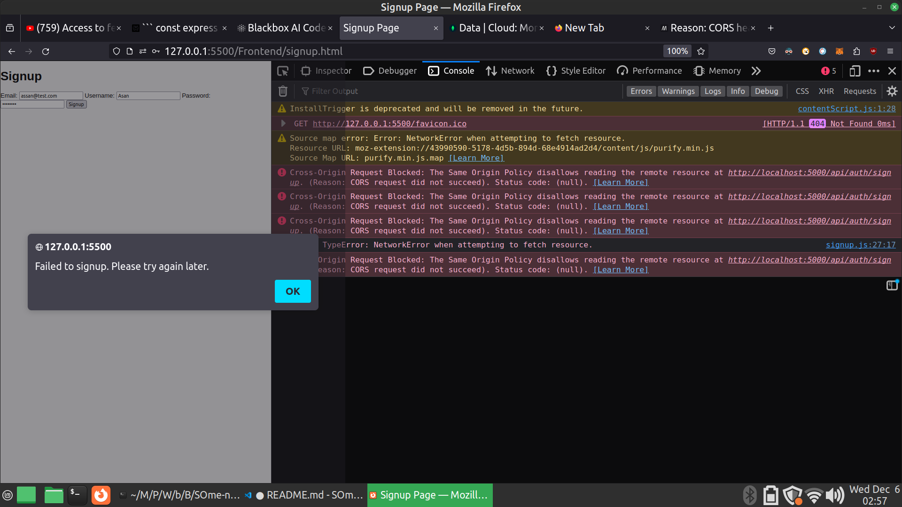
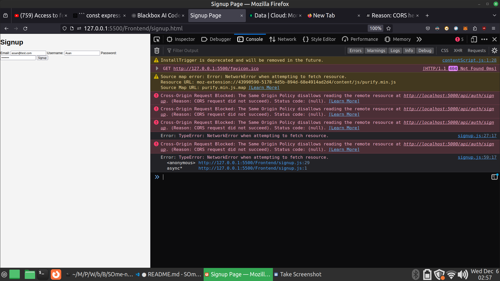

# I am getting the cors error 

Hi I am using Node.js and express.js for backend.  
Now I have used the `cors` still I am getting the cors error on the frontend.  

```console
Cross-Origin Request Blocked: The Same Origin Policy disallows reading the remote resource at http://localhost:5000/api/auth/signup. (Reason: CORS request did not succeed). Status code: (null).

Cross-Origin Request Blocked: The Same Origin Policy disallows reading the remote resource at http://localhost:5000/api/auth/signup. (Reason: CORS request did not succeed). Status code: (null).

Error: TypeError: NetworkError when attempting to fetch resource.
    <anonymous> http://127.0.0.1:5500/Frontend/signup.js:29
    async* http://127.0.0.1:5500/Frontend/signup.js:1
```

## The image

  

